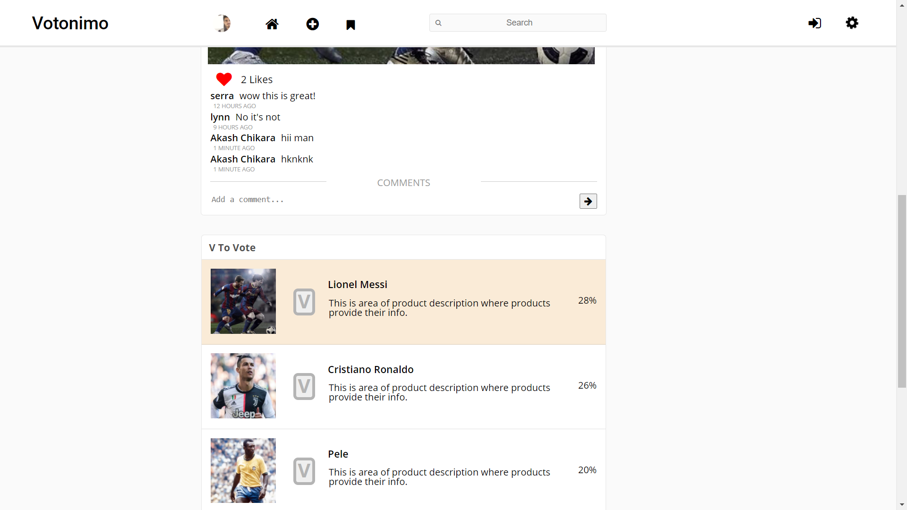

# Votonimo

## Description

Votonimo is a voting based product aggregation and comparison platform that lets a user find the product that best suits his/her interest.

Live Project - https://votonimo.herokuapp.com/

This project is developed in two version(mobile and desktop).

### Prerequisites

What things you need to install this app

```
PHP Server
```
```
MySQL Database
```

### Desktop version screenshots

<br><br><br>

<br><br><br>

<br><br><br>

<br><br><br>

<br><br><br>

### Mobile version screenshots

<br><br><br>

<br><br><br>

<br><br><br>

<br><br><br>
